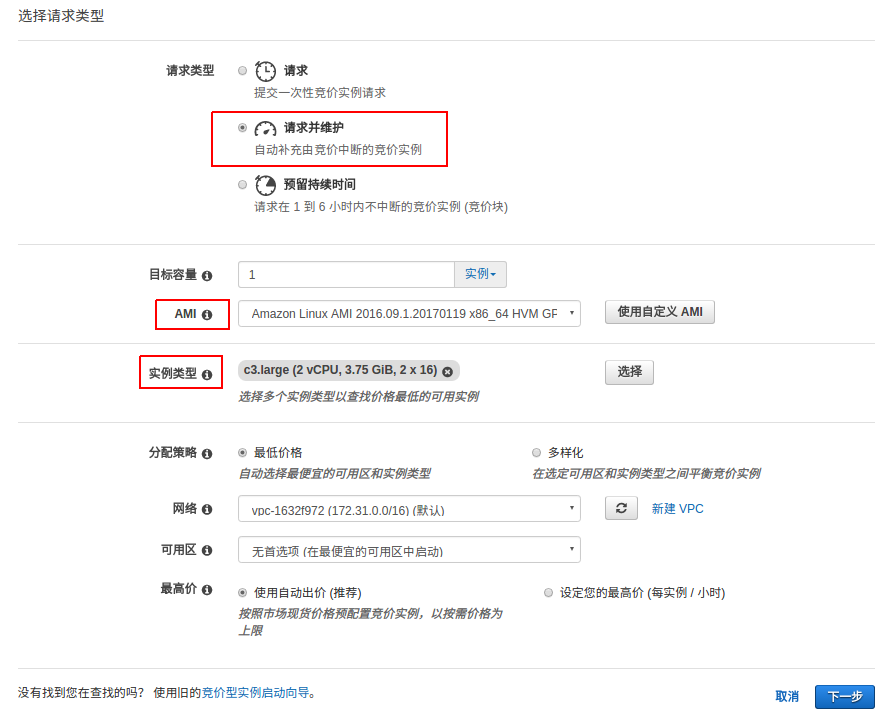
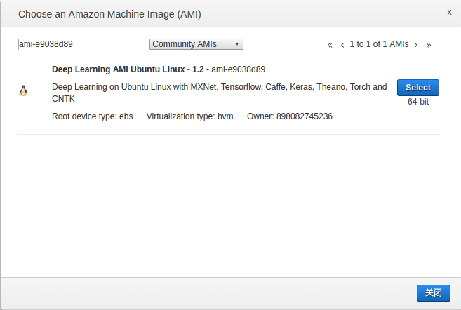
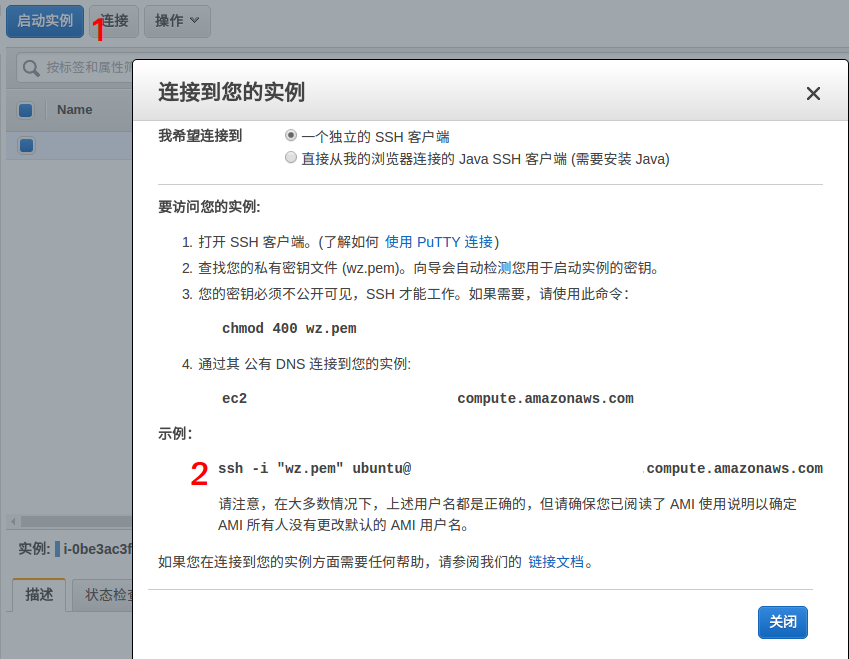
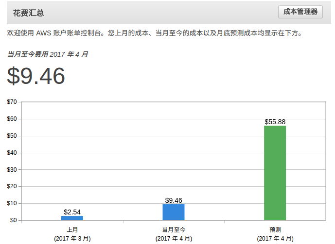

# 如何使用AWS EC2进行深度学习
本教程简要介绍了如何使用`AWS EC2`进行深度学习，由于篇幅有限，这里只包括主要流程，最基本的具体操作可能不够详细。  
教程的测试操作系统为：本地使用`Ubuntu 16.04`，`AWS`上使用`Ubuntu 16.04 Server`  
本教程需要你具有基本的使用`Linux`操作系统的能力，我想既然要做深度学习，那基本上都会使用`Linux`吧。

### 有关AWS
[AWS(Amazon Web Services)](https://aws.amazon.com/cn/)是由`Amazon`创建的云计算平台，提供包括EC2(Elastic Compute Cloud, 云主机)、S3(Simple Storage Service, 云存储服务)在内的多项强大服务。  
其中，`EC2`下的`g2`和`p2`实例含有GPU，可用来进行深度学习训练。

### 使用AWS的理由
1. **价格便宜**：竞价类型g2实例价格大概在0.2美元/小时至0.3美元/小时，简直是白菜价。
2. 配置方便：可在镜像市场选择预先配置好的`AMI(AWS Machine Image)`镜像，开机即可训练。也可免费配置自己的AMI并保存以供下次使用。
3. 国外网速快：`EC2`实例从国外服务器下载资源网速可达数十兆每秒。

### AWS的缺点
1. 如果你在国内，访问`EC2`实例的速度可能比较慢

## 开始使用AWS

### 1. 注册AWS账号
#### 1.1 AWS一年免费使用
现在(2017.4.5)注册`AWS`,即可免费使用其全系列所有云服务最低配产品一年，
但是一年满后要记得停用产品，不然会继续扣钱。  
#### 1.2 使用信用卡
AWS注册时需要绑定信用卡，以后所有费用也都是先使用后通过信用卡结算。  
如果你没有信用卡又觉得申请信用卡麻烦，可以使用只有卡号没有实体卡的**虚拟信用卡**。  
我个人使用的是[全球付](https://www.globalcash.hk/)，网上申请非常快捷方便，账户有效期3年，只要激活后6个月内有交易记录，即可免年费，否则收取年费10RMB。

### 2. 启动实例前的准备
#### 2.1 创建秘钥对
首次开启`EC2`实例前，需要创建一个密钥对，并将私钥下载下来保存到你的电脑上，当使用`ssh`远程登录实例时，只需使用该私钥证明你的身份，无需输入密码。  
**创建方法**：  
1. 首次启动实例时，`AWS`会要求你创建密钥对，创建完成后将**私钥**下载下来保存至~/.ssh/目录。  
注意，由于`Linux`系统安全限制，`.ssh`目录及其中包含的文件权限不能随意设定。我的`.ssh`目录权限为`700`，保存在其中的私钥文件权限为`400`。
2. 或者你也可以上传本机已经存在的密钥对(如果有的话)的**公钥**(一般为`~/.ssh/id_rsa.pub`)，导入至`AWS`密钥对列表中。
#### 2.2 配置安全组
AWS默认的安全组设置屏蔽了除`22`端口(`ssh`登录端口)外的所有入网流量端口，出网流量不受限制，所以如果你要使用`ftp`向`AWS`传文件，或者在`AWS`上建立`HTTP`服务器，就需要配置自己的安全组策略。  
如果你像我一样，只是暂时使用`AWS`进行深度学习，不必考虑服务器安全问题，大可直接以开放所有的端口，配置方法如下：
在EC2控制面板点击`网络与安全`=>`安全组`=>`创建安全组`，填入名称(这里以名称`default`为例)和描述，在入站规则内点击`添加规则`，在`类型`一栏选择`所有流量`，然后点击创建即可。

### 3. 启动竞价类型实例
#### 3.1 为什么选择竞价类型实例
竞价类型实例价格根据使用人数的多少浮动变化，不会超过其对应持久型实例的价格。竞价类型实例一般较为便宜，以`g2.2xlarge`实例为例，使用一小时的花费通常都不到0.3美元。  

#### 3.2 提交竞价请求
在`EC2`控制面板点击`实例`=>`竞价请求`=>`请求竞价型实例`开始提交竞价请求，如下图：

在接下来的选择请求类型页面，主要有三个地方需要注意:  

首先是`请求类型`，一般选择`请求并维护`类型，这种类型开启后系统自动根据当时的最低价给出价格，而`提交一次性竞价请求`可能因为价格变化超出你设置的最高价而导致实例被释放。  
然后是`AMI`，`AMI`其实就是系统镜像。第一次使用，你可以选择从镜像市场选择别人预先配置好深度学习框架的镜像(稍后我会介绍如何创建自己的`AMI`，这样就不用每次使用都要重新配置环境了)，点击右侧的`使用自定义AMI`,选择`Community AMIS`,然后输入`deep learning`,可以搜到很多镜像，根据你的需要选择，或者你可以直接搜索我常用的镜像`ami-e9038d89`，系统环境为`Ubuntu 16.04 Server`,常见深度学习框架一应俱全，如下图所示：

最后是实例类型，这里可选择的有`g2`类型(GPU: 4G显存Grid K520, 15G内存，60G硬盘)和`p2`类型(GPU: 12G显存K80，61G内存)，根据你自己的需要选择。

#### 3.3 通过ssh登录实例
在`实例`页面点击`连接`会弹出连接提示窗口，有多种方式可以连接到实例，但我个人最喜欢直接用`Linux`自带的`ssh`来连接，将页面中的命令复制下来，粘贴到`terminal`中执行，如果你的秘钥**权限**设置没问题的话，应该就可以连接到你的`AWS`实例了。  

### 4. 使用Google Drive做文件中转

#### 4.1 上传训练数据
因为国内访问`AWS`的速度比较慢，当你需要向`AWS`发送训练数据，或者从实例上下载已经训练好的模型时，就比较麻烦了。不过`AWS`本身访问国外的网站速度非常快，所以你可以先把数据上传到`Google Drive`，再在`AWS`上使用`wget`命令将数据下载下来，但这样对比较大的训练集来说可能还是太慢。一种解决方法是，尽量找到放在国外服务器上的数据集资源，再直接在`AWS`上下载。

#### 4.2 下载模型
从实例上下载训练好的网络模型相比上传数据集更麻烦一点，因为`Ubuntu Server`没有桌面环境(估计就算装了桌面环境，使用远程控制软件也会非常卡)，无法直接从网页向`Google Drive`上传文件。我采取的解决方案是，在`AWS`上用脚本调用`Google Drive`的API来快速上传文件，再在自己电脑上登录`Google Drive`将模型下载下来。使用`Google Drive` API需要先到谷歌开发者控制台申请，具体教程请移步[这里](https://pythonhosted.org/PyDrive/quickstart.html)。
在[这里](https://github.com/wzbazinga/facial-expression-recognition/tree/master/aws/googledrive)我写了一些`Python`脚本用来处理与`Google Drive`之间的文件上传和下载。

### 5. 创建AMI
每次申请新的实例都要重新配置环境实在是太浪费时间了，幸好`AWS`为我们提供了创建个人`AMI`的功能。大大方便了`AWS`的使用。  
在`EC2`控制面板点击`实例`选中正在运行的一个实例，再点击`操作`=>`映像`=>`创建映像`，即可将当前实例上的硬盘数据保存为`AMI`。  
下次启动实例时，在`AMI`里选择自己之前创建的`AMI`就可以接着上次的实例环境继续操作了。

### 6. 终止实例
注意`AWS`实例只要还未终止(terminate)，就算已经关机(stop)，就会计费。所以，在训练完毕后，请务必记住终止实例，否则你就等着月底看到你信用卡账单上的巨额费用吧。网上流传的使用`AWS`什么都没做却收到了几千美元的账单应该就是因为没有及时终止实例。  
在`竞价请求`页面选中请求，点击`操作`=>`取消竞价请求`=>`确认`(勾选上`终止实例`)来终止你的实例。

### 7. 关注你的账单
在`EC2`控制面板左上角点击`服务`=>`账单`查看你在`AWS`上产生的费用。防止巨额意外费用产生。

## 总结
以上是我个人使用`EC2`做自己的深度学习毕设近一个月来的经验，个人感觉开始时可能会有很多不习惯和麻烦的地方，但用熟了之后会发现`EC2`简直太好用了。几乎完全能够满足我对深度学习训练机器的要求。  
由于`AWS`上的很多功能我还没有用到，这篇教程里的一些方法可能不是最优解决方案，如果你有更好的使用`AWS`的技巧，或是发现此教程中存在错误，欢迎直接提交issue。